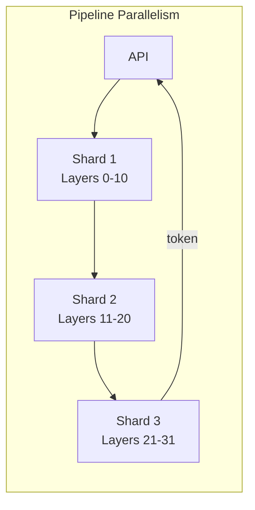
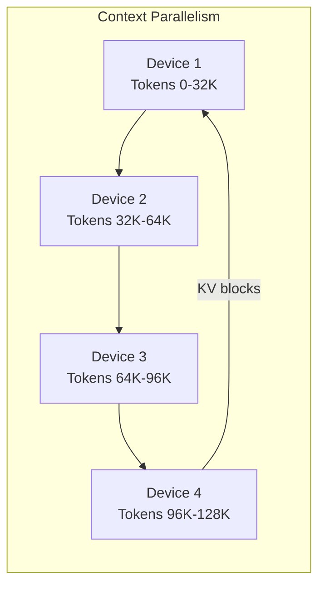
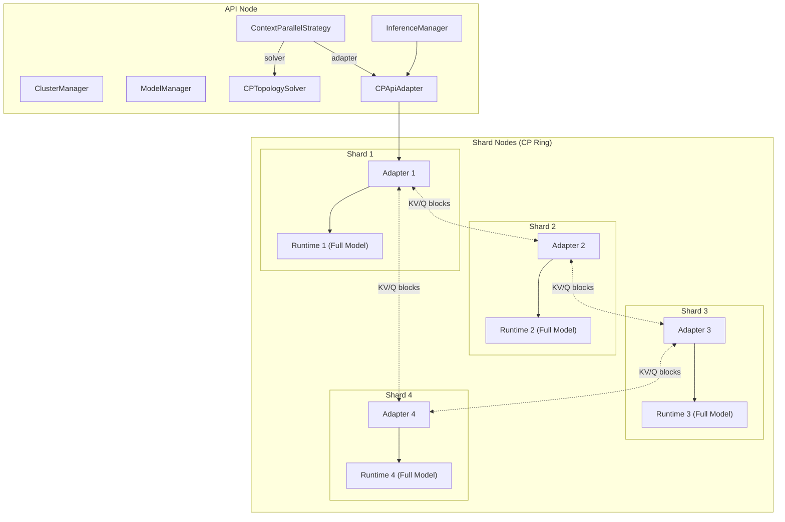

# Context Parallelism for Long-Context Inference

## 1. Executive Summary

This document describes the design for adding **Context Parallelism (CP)** to dnet, enabling long-context inference (128K+ tokens) by distributing sequence dimensions across multiple Apple Silicon devices. CP complements the existing **RingStrategy** (layer/pipeline parallelism) with a new axis of parallelization.

### Goals

- **Primary**: Enable 128K+ context inference across heterogeneous device clusters
- **Secondary**: Achieve near-linear latency scaling with device count
- **Constraint**: Zero approximations to attention computation (exact attention)

### Non-Goals (v1)

- Mixed CP + pipeline parallelism (future work)
- Training support (inference-only)
- CUDA/AMD backends (Apple Silicon only)

---

## 2. Background

### 2.1 Current Architecture



The current dnet uses **pipeline parallelism**: each shard owns a subset of layers, and activations flow through the ring. This works well for large models but does **not** reduce per-device context memory.

### 2.2 Problem Statement

| Context Length | KV Cache (FP16, 7B model) | Fits in 24GB RAM? |
|----------------|---------------------------|-------------------|
| 8K             | ~1 GB                     | Yes               |
| 32K            | ~4 GB                     | Yes               |
| 128K           | ~16 GB                    | Tight             |
| 512K           | ~64 GB                    | No                |
| 1M             | ~128 GB                   | No                |

Pipeline parallelism does **not** shard KV cache across devices. Context Parallelism solves this.

### 2.3 Ring Attention

Ring Attention (Liu et al., 2023) distributes the **sequence dimension** across devices:



Key insight: Blockwise attention is **permutation invariant** over KV blocks, so we can compute partial attention in any order and merge results.

---

## 3. Design Overview

### 3.1 High-Level Architecture



**Data Flow**:

1. API receives request → `InferenceManager` → `CPApiAdapter`
2. `CPApiAdapter` sends sharded tokens to Shard 1 (head of ring)
3. Each shard computes partial attention, rotates KV/Q blocks around ring
4. Final merged output returns to API via `CPApiAdapter`

### 3.2 Key Differences from RingStrategy

| Aspect              | RingStrategy (Pipeline)    | ContextParallelStrategy        |
|---------------------|----------------------------|--------------------------------|
| Sharding axis       | Layers                     | Sequence (tokens)              |
| Model per device    | Partial (subset of layers) | Full (all layers)              |
| KV cache per device | Full context               | 1/N of context                 |
| Communication       | Activations between layers | KV or Q blocks between devices |
| Memory scaling      | With model size            | With context length            |

---

## 4. Detailed Design

### 4.1 New Components

#### 4.1.1 Load-Balanced Sharding

Causal attention has asymmetric compute: later tokens attend to more predecessors. Naive even partitioning causes load imbalance.

**Solution**: Partition sequence into `2N` chunks, assign complementary pairs:

```text
Sequence: [C0, C1, C2, C3, C4, C5, C6, C7]  (8 chunks for 4 devices)

Device 0: [C0, C7]  # first + last
Device 1: [C1, C6]
Device 2: [C2, C5]
Device 3: [C3, C4]
```

Each device gets roughly equal compute load.

```python
# src/dnet/core/cp/sharding.py
def load_balanced_shard(
    tokens: mx.array,  # [seq_len, ...]
    num_ranks: int,
    rank_id: int,
) -> tuple[mx.array, list[int]]:
    """
    Shard tokens with load balancing for causal attention.

    Returns:
        sharded_tokens: tokens for this rank
        chunk_indices: original positions (for unsharding)
    """
    seq_len = tokens.shape[0]
    chunk_size = seq_len // (2 * num_ranks)

    # Assign chunks (i, 2N-i-1) to rank i
    chunk_a = rank_id
    chunk_b = 2 * num_ranks - rank_id - 1

    start_a = chunk_a * chunk_size
    end_a = start_a + chunk_size
    start_b = chunk_b * chunk_size
    end_b = start_b + chunk_size if chunk_b < 2 * num_ranks - 1 else seq_len

    sharded = mx.concatenate([tokens[start_a:end_a], tokens[start_b:end_b]])
    chunk_indices = list(range(start_a, end_a)) + list(range(start_b, end_b))

    return sharded, chunk_indices
```

#### 4.1.2 Merge Attention Operator

When computing blockwise attention across distributed KV, each device produces partial outputs with local softmax denominators. These must be merged correctly.

**Math**: For blocks with outputs `O_i`, max scores `m_i`, and log-sum-exp `l_i`:

```text
m_global = max(m_1, m_2, ..., m_N)
l_global = sum(exp(m_i - m_global) * l_i)
O_merged = sum(exp(m_i - m_global) * l_i * O_i) / l_global
```

```python
# src/dnet/core/cp/merge_attention.py
@dataclass
class PartialAttentionOutput:
    output: mx.array       # [batch, seq, heads, dim]
    max_score: mx.array    # [batch, seq, heads]
    log_sum_exp: mx.array  # [batch, seq, heads]

def merge_partial_attention(
    partials: list[PartialAttentionOutput],
) -> mx.array:
    """Merge partial attention outputs with numerically stable rescaling."""
    # Find global max for stability
    m_global = partials[0].max_score
    for p in partials[1:]:
        m_global = mx.maximum(m_global, p.max_score)

    # Rescale and accumulate
    numerator = mx.zeros_like(partials[0].output)
    denominator = mx.zeros_like(partials[0].log_sum_exp)

    for p in partials:
        scale = mx.exp(p.max_score - m_global)
        numerator += scale[..., None] * p.log_sum_exp[..., None] * p.output
        denominator += scale * p.log_sum_exp

    return numerator / denominator[..., None]
```

#### 4.1.3 Ring Communication

gRPC-based ring for passing KV or Q blocks between CP ranks.

```python
# src/dnet/core/cp/ring_comm.py
class CPRingCommunicator:
    """Manages ring communication for context parallelism."""

    def __init__(
        self,
        rank_id: int,
        num_ranks: int,
        discovery: AsyncDnetP2P,
    ):
        self.rank_id = rank_id
        self.num_ranks = num_ranks
        self._prev_rank = (rank_id - 1) % num_ranks
        self._next_rank = (rank_id + 1) % num_ranks
        self._discovery = discovery

        # gRPC channels
        self._prev_channel: Optional[aio_grpc.Channel] = None
        self._next_channel: Optional[aio_grpc.Channel] = None

    async def send_recv(
        self,
        send_data: bytes,
        tag: str,
    ) -> bytes:
        """
        Simultaneously send to next rank and receive from previous rank.
        Overlaps communication with computation when used correctly.
        """
        send_task = asyncio.create_task(self._send_to_next(send_data, tag))
        recv_task = asyncio.create_task(self._recv_from_prev(tag))

        await send_task
        return await recv_task
```

### 4.2 Ring Attention Variants

#### 4.2.1 Pass-KV (Full Prefill)

Best for full prefill where KV is smaller than Q (GQA models: 8 KV heads vs 128 Q heads).

```python
# src/dnet/shard/adapters/context_parallel.py
async def ring_pass_kv_attention(
    self,
    query: mx.array,      # Local Q chunk
    key: mx.array,        # Local K chunk (will be rotated)
    value: mx.array,      # Local V chunk (will be rotated)
) -> mx.array:
    """
    Ring attention with KV rotation.

    Algorithm:
    1. Compute local attention: Attn(Q_local, KV_local)
    2. For i in 1..N-1:
        a. SendRecv: send KV to next, receive from prev
        b. Compute partial attention with received KV
        c. Accumulate partial outputs
    3. Merge all partial outputs
    """
    partials: list[PartialAttentionOutput] = []

    # Local attention first
    local_out = self._compute_partial_attention(query, key, value)
    partials.append(local_out)

    current_k, current_v = key, value

    for step in range(1, self.num_ranks):
        # Overlap: send current KV while computing with previous
        kv_bytes = self._serialize_kv(current_k, current_v)
        recv_bytes = await self.ring_comm.send_recv(kv_bytes, f"kv_{step}")
        current_k, current_v = self._deserialize_kv(recv_bytes)

        # Compute attention with received KV
        partial = self._compute_partial_attention(query, current_k, current_v)
        partials.append(partial)

    return merge_partial_attention(partials)
```

#### 4.2.2 Pass-Q (Decode / High Cache Hit)

Best for decode (single token Q) or partial prefill with high cache hit rate.

```python
async def ring_pass_q_attention(
    self,
    query: mx.array,      # Local Q chunk (will be rotated)
    key: mx.array,        # Full local K (stationary)
    value: mx.array,      # Full local V (stationary)
) -> mx.array:
    """
    Ring attention with Q rotation.

    Key difference: After ring loop, partial outputs are scattered
    across ranks. Requires All2All to redistribute.
    """
    # Compute attention for local Q against local KV
    local_outputs: dict[int, PartialAttentionOutput] = {}

    current_q = query
    source_rank = self.rank_id

    for step in range(self.num_ranks):
        # Compute attention: Q from source_rank, KV from local
        partial = self._compute_partial_attention(current_q, key, value)
        local_outputs[source_rank] = partial

        if step < self.num_ranks - 1:
            q_bytes = self._serialize_q(current_q)
            recv_bytes = await self.ring_comm.send_recv(q_bytes, f"q_{step}")
            current_q = self._deserialize_q(recv_bytes)
            source_rank = (source_rank - 1) % self.num_ranks

    # All2All: redistribute partial outputs to source ranks
    my_partials = await self._all2all_outputs(local_outputs)

    return merge_partial_attention(my_partials)
```

#### 4.2.3 Adaptive Heuristic

```python
# src/dnet/core/cp/heuristics.py
def select_ring_algorithm(
    new_tokens: int,              # T
    cached_tokens: int,           # P
    num_kv_heads: int,            # NKV
    num_q_heads: int,             # NH
    num_ranks: int,               # N
    flops_per_device: float,      # C
    inter_device_bandwidth: float # BW
) -> Literal["pass_kv", "pass_q"]:
    """
    Select optimal ring algorithm based on cache miss rate and arithmetic intensity.

    Heuristic (from Meta's paper):
    - pass-KV if T/(T+P) >= 2*NKV/NH (cache miss rate threshold)
    - pass-KV if T >= N * (C * NKV * e) / (2 * NH * BW) (sufficient compute)
    - pass-Q otherwise
    """
    total_tokens = new_tokens + cached_tokens
    miss_rate = new_tokens / total_tokens if total_tokens > 0 else 1.0

    # Threshold from GQA ratio
    gqa_threshold = 2 * num_kv_heads / num_q_heads  # e.g., 2*8/128 = 0.125

    if miss_rate >= gqa_threshold:
        return "pass_kv"

    # Check if sufficient compute to overlap pass-KV communication
    element_size = 2  # bfloat16
    min_tokens_for_overlap = num_ranks * (flops_per_device * num_kv_heads * element_size) / (2 * num_q_heads * inter_device_bandwidth)

    if new_tokens >= min_tokens_for_overlap:
        return "pass_kv"

    return "pass_q"
```

### 4.3 Strategy Integration

#### 4.3.1 ContextParallelStrategy

```python
# src/dnet/api/strategies/context_parallel.py
class CPTopologySolver(TopologySolver):
    """Topology solver for context parallelism."""

    async def solve(
        self,
        profiles: Dict[str, DeviceProfile],
        model_profile: Any,
        model_name: str,
        num_layers: int,
        kv_bits: Literal["4bit", "8bit", "fp16"],
        shards: Dict[str, DnetDeviceProperties],
        thunderbolts: Dict[str, Dict[str, ThunderboltConnection]],
    ) -> CPTopologyInfo:
        """
        For CP, all devices get the full model.
        Optimize ordering for ring bandwidth.
        """
        # Order devices by Thunderbolt connectivity for minimal latency
        ordered = self._optimize_ring_order(shards, thunderbolts)

        return CPTopologyInfo(
            model=model_name,
            kv_bits=kv_bits,
            num_layers=num_layers,
            devices=ordered,
            # Each device gets ALL layers (full model)
            assignments={name: list(range(num_layers)) for name in ordered},
            num_cp_ranks=len(ordered),
        )


class ContextParallelStrategy(Strategy):
    """Execution strategy using context parallelism."""

    def __init__(self):
        self._solver = CPTopologySolver()
        self._adapter = CPApiAdapter()

    @property
    def solver(self) -> TopologySolver:
        return self._solver

    @property
    def adapter(self) -> ApiAdapterBase:
        return self._adapter
```

#### 4.3.2 Shard-Side CPAdapter

```python
# src/dnet/shard/adapters/context_parallel.py
class CPAdapter(ShardAdapterBase):
    """Context parallel adapter for shards."""

    def __init__(
        self,
        runtime: ShardRuntime,
        discovery: AsyncDnetP2P,
        rank_id: int,
        num_ranks: int,
    ):
        super().__init__(runtime, discovery)
        self.rank_id = rank_id
        self.num_ranks = num_ranks
        self.ring_comm = CPRingCommunicator(rank_id, num_ranks, discovery)
        self._algorithm: Literal["pass_kv", "pass_q"] = "pass_kv"

    async def configure_topology(self, req: ShardLoadModelRequest) -> None:
        """Configure CP topology from load request."""
        self.rank_id = req.cp_rank_id
        self.num_ranks = req.cp_num_ranks
        await self.ring_comm.connect_neighbors()

    async def process_activation(self, msg: ActivationMessage) -> ActivationMessage:
        """Process with context-parallel attention."""
        # 1. Load-balanced unshard to get local tokens
        local_tokens, indices = load_balanced_shard(
            msg.tokens, self.num_ranks, self.rank_id
        )

        # 2. Compute embeddings and projections locally
        hidden = self.runtime.compute_embeddings(local_tokens)
        q, k, v = self.runtime.compute_qkv(hidden)

        # 3. Ring attention (select algorithm dynamically)
        if self._algorithm == "pass_kv":
            attn_out = await self.ring_pass_kv_attention(q, k, v)
        else:
            attn_out = await self.ring_pass_q_attention(q, k, v)

        # 4. FFN + output projection (local compute)
        output = self.runtime.compute_ffn(attn_out)

        return msg.with_output(output, indices)
```

### 4.4 Configuration

Following the existing pattern in `config.py`, we use `Literal` types for constrained choices (which Pydantic validates) and integrate with the `.env.example` auto-generation via `scripts/generate_env_example.py`.

```python
# src/dnet/config.py (additions)
from enum import StrEnum

class CPAlgorithm(StrEnum):
    """Ring attention algorithm selection."""
    AUTO = "auto"       # Dynamic selection based on heuristics
    PASS_KV = "pass_kv" # Rotate KV blocks (best for prefill)
    PASS_Q = "pass_q"   # Rotate Q blocks (best for decode)


class ContextParallelSettings(BaseSettings):
    """Context parallelism configuration."""

    model_config = SettingsConfigDict(env_prefix="DNET_CP_")

    enabled: bool = Field(
        default=False,
        description="Enable context parallelism mode",
    )
    algorithm: CPAlgorithm = Field(
        default=CPAlgorithm.AUTO,
        description="Ring attention algorithm (auto, pass_kv, pass_q)",
    )
    min_context_for_cp: int = Field(
        default=32768,
        description="Minimum context length to enable CP (below this, single-device)",
    )
    chunk_overlap: int = Field(
        default=0,
        description="Overlap between chunks for sliding window attention",
    )
```

**`.env.example` Integration**:

1. Add `ContextParallelSettings` to `generate_env_example.py`:

```python
# scripts/generate_env_example.py
from dnet.config import ContextParallelSettings

settings_sections = [
    # ... existing ...
    ("Context Parallelism", ContextParallelSettings),
]
```

1. Run `make env-example` to regenerate `.env.example` with CP settings:

```bash
# Generated output:
# === Context Parallelism ===
# Enable context parallelism mode
DNET_CP_ENABLED=false
# Ring attention algorithm (auto, pass_kv, pass_q)
DNET_CP_ALGORITHM=auto
# Minimum context length to enable CP (below this, single-device)
DNET_CP_MIN_CONTEXT_FOR_CP=32768
# Overlap between chunks for sliding window attention
DNET_CP_CHUNK_OVERLAP=0
```

### 4.5 Protocol Changes

#### Decision: Separate proto file vs. additions to existing

| Approach                     | Pros                                                          | Cons                                                       |
|------------------------------|---------------------------------------------------------------|------------------------------------------------------------|
| **Separate `dnet_cp.proto`** | Clean separation; easier to deprecate; independent versioning | More generated files; cross-import needed for shared types |
| **Add to `dnet_ring.proto`** | Reuses existing types (`ActivationRequest`); fewer imports    | Couples CP to ring; larger proto file                      |

**Recommendation**: Create `dnet_cp.proto` as a **separate file** because:

1. CP and pipeline ring are independent strategies—they shouldn't be coupled
2. `KVBlockTransfer`/`QBlockTransfer` are CP-specific and don't belong in ring transport
3. Easier to iterate on CP without risk of breaking existing ring protocol

```protobuf
// src/dnet/protos/dnet_cp.proto (NEW FILE)
syntax = "proto3";
package dnetcp;

// Context Parallelism ring communication service
service CPRingService {
    // Bidirectional stream for KV/Q block transfer
    rpc StreamBlocks(stream CPBlockFrame) returns (stream CPBlockAck);
}

// Configuration for CP distributed attention
message CPConfig {
    int32 rank_id = 1;
    int32 num_ranks = 2;
    repeated string rank_addresses = 3;  // Ordered ring addresses
    string algorithm = 4;                // "pass_kv" or "pass_q"
}

// Frame for streaming KV or Q blocks
message CPBlockFrame {
    string nonce = 1;
    int32 source_rank = 2;
    int32 layer_id = 3;
    oneof payload {
        KVBlock kv_block = 4;
        QBlock q_block = 5;
    }
    uint64 seq = 6;
}

message KVBlock {
    bytes key_data = 1;
    bytes value_data = 2;
    bytes max_scores = 3;    // For merge attention
    bytes log_sum_exp = 4;
}

message QBlock {
    bytes query_data = 1;
    repeated int32 token_indices = 2;  // For unsharding
}

message CPBlockAck {
    string nonce = 1;
    uint64 seq = 2;
    bool accepted = 3;
}
```

**Minor addition to `dnet_ring.proto`** (for CP-enabled requests):

```protobuf
// src/dnet/protos/dnet_ring.proto - add to ActivationRequest
message ActivationRequest {
    // ... existing fields 1-13 ...
    optional CPConfig cp_config = 14;  // CP metadata (if CP mode)
}
```

---

## 5. Proposed Changes

### 5.1 New Files

| File                                          | Purpose                                    |
|-----------------------------------------------|--------------------------------------------|
| `src/dnet/core/cp/__init__.py`                | CP subpackage                              |
| `src/dnet/core/cp/sharding.py`                | Load-balanced sharding utilities           |
| `src/dnet/core/cp/merge_attention.py`         | Merge attention operator                   |
| `src/dnet/core/cp/ring_comm.py`               | Ring communication primitives              |
| `src/dnet/core/cp/heuristics.py`              | Algorithm selection heuristics             |
| `src/dnet/api/strategies/context_parallel.py` | CPTopologySolver + ContextParallelStrategy |
| `src/dnet/shard/adapters/context_parallel.py` | CPAdapter                                  |
| `tests/subsystems/test_cp_sharding.py`        | Sharding unit tests                        |
| `tests/subsystems/test_cp_merge.py`           | Merge attention tests                      |
| `tests/subsystems/test_cp_heuristics.py`      | Heuristic tests                            |

### 5.2 Modified Files

#### [MODIFY] [config.py](file:///home/jaiswal0/Desktop/dria/repo/dnet/src/dnet/config.py)

- Add `ContextParallelSettings` class
- Add `context_parallel: ContextParallelSettings` to `DnetSettings`

#### [MODIFY] [dnet_ring.proto](file:///home/jaiswal0/Desktop/dria/repo/dnet/src/dnet/protos/dnet_ring.proto)

- Add `CPConfig`, `KVBlockTransfer`, `QBlockTransfer` messages
- Add `cp_config` field to `ActivationRequest`

#### [MODIFY] [api.py](file:///home/jaiswal0/Desktop/dria/repo/dnet/src/cli/api.py)

- Add strategy selection based on config (RingStrategy vs ContextParallelStrategy)

#### [MODIFY] [shard.py](file:///home/jaiswal0/Desktop/dria/repo/dnet/src/cli/shard.py)

- Add adapter selection based on topology info

#### [MODIFY] [models.py](file:///home/jaiswal0/Desktop/dria/repo/dnet/src/dnet/shard/models.py)

- Add `cp_rank_id`, `cp_num_ranks` to `ShardLoadModelRequest`

---

## 6. Implementation Phases

### Phase 1: Core Infrastructure (2-3 days)

1. Create `src/dnet/core/cp/` package
2. Implement `sharding.py` with load-balanced partitioning
3. Implement `merge_attention.py` with numerically stable merging
4. Add unit tests for sharding and merging

### Phase 2: Ring Communication (2-3 days)

1. Implement `ring_comm.py` with gRPC send/recv
2. Add protobuf messages for KV/Q block transfers
3. Test ring formation with fake discovery

### Phase 3: Ring Attention Variants (3-4 days)

1. Implement pass-KV algorithm in `CPAdapter`
2. Implement pass-Q algorithm with All2All
3. Implement adaptive heuristic
4. Integration tests with 2+ simulated ranks

### Phase 4: Strategy Integration (2-3 days)

1. Implement `ContextParallelStrategy` class
2. Modify CLI entry points for strategy selection
3. Add configuration options
4. End-to-end test with real multi-device setup

### Phase 5: Verification & Optimization (2-3 days)

1. Benchmark against RingStrategy baseline
2. Memory profiling for 128K+ contexts
3. Documentation updates

---

## 7. Verification Plan

### 7.1 Unit Tests

**Sharding Tests** (`tests/subsystems/test_cp_sharding.py`):

```bash
uv run pytest tests/subsystems/test_cp_sharding.py -v
```

- Test load-balanced partitioning produces equal-sized chunks
- Test round-trip shard → unshard preserves data
- Test chunk indices are correct for causal masking

**Merge Attention Tests** (`tests/subsystems/test_cp_merge.py`):

```bash
uv run pytest tests/subsystems/test_cp_merge.py -v
```

- Test merging 2 partial outputs matches full attention
- Test numerical stability with extreme max scores
- Test empty partials handling

**Heuristic Tests** (`tests/subsystems/test_cp_heuristics.py`):

```bash
uv run pytest tests/subsystems/test_cp_heuristics.py -v
```

- Test pass-KV selected for full prefill
- Test pass-Q selected for decode
- Test boundary conditions at GQA threshold

### 7.2 Integration Tests

**Ring Communication** (`tests/integration/test_cp_ring.py`):

```bash
uv run pytest tests/integration/test_cp_ring.py -v
```

- Test 4-rank ring with mock discovery
- Test simultaneous send/recv completes
- Test graceful handling of rank failure

### 7.3 CI Workflow for Coordinated Multi-Runner E2E Tests

Since dnet has 2 self-hosted macOS runners (`mac2.metal`), we can design a workflow that **coordinates both runners** for CP e2e tests:

**Approach**: Use a **hostfile + static discovery** pattern (similar to `test-static-discovery.yml`) where:

1. Both runners register their IPs to a shared artifact
2. One runner acts as API + Shard 1, the other as Shard 2
3. Static hostfile enables cross-runner communication

```yaml
# .github/workflows/test-context-parallel.yml
name: Test Context Parallelism E2E

on:
  workflow_dispatch:  # Manual trigger for expensive e2e tests
  schedule:
    - cron: '0 6 * * 1'  # Weekly on Monday 6AM UTC

jobs:
  # Job 1: Coordination - creates hostfile and waits for both runners
  coordinate:
    runs-on: ubuntu-latest
    outputs:
      hostfile: ${{ steps.gen.outputs.hostfile }}
    steps:
      - id: gen
        run: echo "hostfile=will be generated dynamically" >> $GITHUB_OUTPUT

  # Job 2: Runner A - API node + Shard 1 (CP rank 0)
  runner-a:
    runs-on: mac2.metal  # First self-hosted runner
    needs: coordinate
    env:
      RUNNER_ROLE: shard1_and_api
    steps:
      - uses: actions/checkout@v4
        with:
          submodules: recursive

      - name: Setup Environment
        uses: ./.github/actions/setup-env

      - name: Get Runner IP
        id: ip
        run: echo "ip=$(ipconfig getifaddr en0 || echo 127.0.0.1)" >> $GITHUB_OUTPUT

      - name: Upload IP for coordination
        uses: actions/upload-artifact@v4
        with:
          name: runner-a-ip
          path: ${{ steps.ip.outputs.ip }}

      - name: Wait for Runner B IP
        uses: actions/download-artifact@v4
        with:
          name: runner-b-ip
          path: ./runner-b-ip
        continue-on-error: true
        timeout-minutes: 5

      - name: Start Shard 1
        run: |
          uv run dnet-shard --http-port 8081 --grpc-port 58081 --shard-name cp-shard-0 &
          sleep 5

      - name: Create hostfile
        run: |
          echo "cp-shard-0 ${{ steps.ip.outputs.ip }} 8081 58081" > hostfile
          cat ./runner-b-ip >> hostfile 2>/dev/null || echo "# Runner B not ready"

      - name: Start API with CP enabled
        run: |
          DNET_CP_ENABLED=true uv run dnet-api --http-port 8080 --grpc-port 58080 --hostfile hostfile &
          sleep 10

      - name: Run CP E2E test
        run: |
          uv run python scripts/test_cp_e2e.py --context-length 32768

  # Job 3: Runner B - Shard 2 (CP rank 1)
  runner-b:
    runs-on: mac2.metal  # Second self-hosted runner (if labeled differently)
    needs: coordinate
    env:
      RUNNER_ROLE: shard2
    steps:
      - uses: actions/checkout@v4
        with:
          submodules: recursive

      - name: Setup Environment
        uses: ./.github/actions/setup-env

      - name: Get Runner IP
        id: ip
        run: echo "ip=$(ipconfig getifaddr en0)" >> $GITHUB_OUTPUT

      - name: Upload IP
        run: echo "cp-shard-1 ${{ steps.ip.outputs.ip }} 8082 58082" > runner-b-ip.txt
      - uses: actions/upload-artifact@v4
        with:
          name: runner-b-ip
          path: runner-b-ip.txt

      - name: Start Shard 2 and wait
        run: |
          uv run dnet-shard --http-port 8082 --grpc-port 58082 --shard-name cp-shard-1
```

> [!WARNING]
> **Challenge**: GitHub Actions artifact uploads/downloads add latency. For reliable coordination, consider:
>
> 1. Use a shared storage (S3/GCS) for IP exchange
> 2. Add retry logic for artifact downloads
> 3. Increase timeouts for cross-runner synchronization

### 7.4 Manual Verification (Local Development)

**Single-machine test** (2 shards on localhost):

```bash
# Terminal 1: Shard 1
uv run dnet-shard --http-port 8081 --grpc-port 58081 --shard-name cp-shard-0

# Terminal 2: Shard 2
uv run dnet-shard --http-port 8082 --grpc-port 58082 --shard-name cp-shard-1

# Terminal 3: Create hostfile and start API
echo "cp-shard-0 127.0.0.1 8081 58081" > hostfile
echo "cp-shard-1 127.0.0.1 8082 58082" >> hostfile
DNET_CP_ENABLED=true uv run dnet-api --http-port 8080 --grpc-port 58080 --hostfile hostfile

# Terminal 4: Test
curl -X POST http://localhost:8080/v1/prepare_topology \
  -H "Content-Type: application/json" \
  -d '{"model": "Qwen/Qwen3-4B-MLX-4bit", "strategy": "context_parallel"}'
```

**Cross-machine test** (2 Apple Silicon devices on same network):

1. Note IPs of both machines (e.g., `192.168.1.10`, `192.168.1.11`)
2. Start shards on each machine with their respective IPs
3. Create hostfile on API machine with both shard entries
4. Verify response coherence and memory distribution

---

## 8. Risks and Mitigations

| Risk                                  | Mitigation                                                              |
|---------------------------------------|-------------------------------------------------------------------------|
| Thunderbolt bandwidth insufficient    | Profile actual bandwidth; fall back to pipeline if CP overhead too high |
| Merge attention numerical instability | Use log-space accumulation; add extensive numerical tests               |
| All2All latency for pass-Q            | Implement async All2All; consider hierarchical reduction                |
| Model too large for full replication  | CP requires full model per device; document minimum memory requirements |

---

## 9. Future Work

1. **Hybrid CP + PP**: Combine context and pipeline parallelism for very large models with long contexts
2. **Speculative Decoding**: Leverage CP for parallel draft generation
3. **Persistent KV Cache**: Optimize multi-turn conversations with sharded persistent cache
4. **Training Support**: Extend CP to gradient computation

---

## 10. References

1. Liu et al., "Ring Attention with Blockwise Transformers for Near-Infinite Context" (arXiv:2310.01889)
2. Yang et al., "Context Parallelism for Scalable Million-Token Inference" (arXiv:2411.01783)
3. [dnet Repository](https://github.com/firstbatchxyz/dnet)
